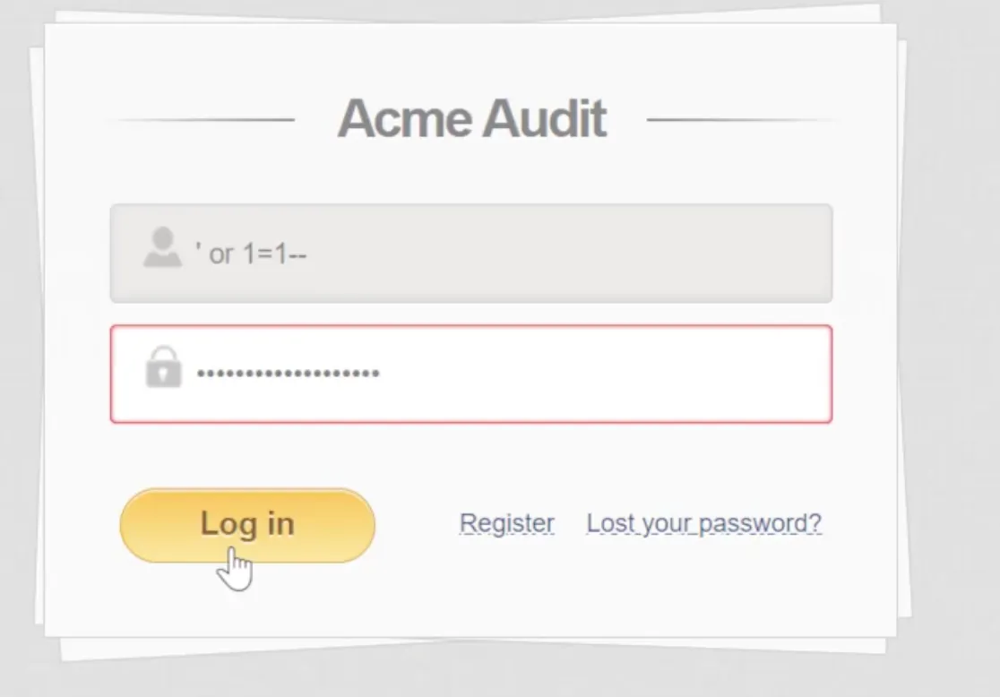
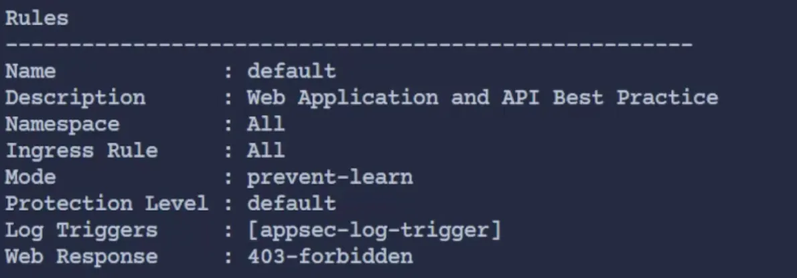
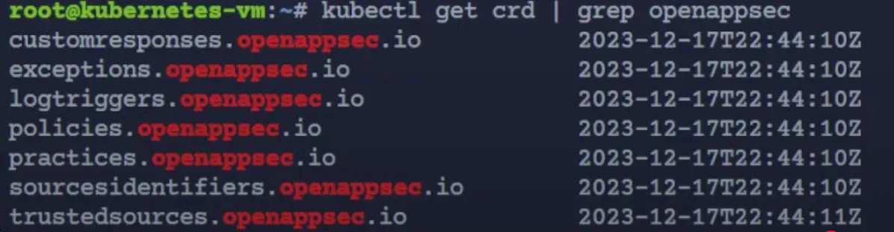
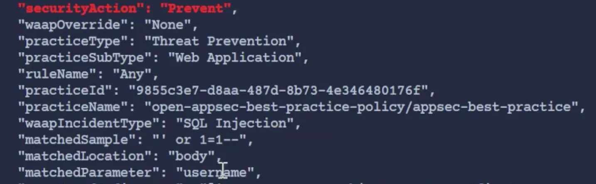

## Day 14 - An introduction to API Security in Kubernetes

### 1. 쿠버네티스 API 서버 보안

**1-1. 전송 보안**

- kubead을 사용하여 설치할 경우, 인증서와 TLS 설정 자동 처리

**1-2. 인증**

- 접근 허용
- 쿠버네티스 자체에는 사용자 개념이 없어, OpenID Connect와 같은 외부 애플리케이션 사용
- OpenShft와 같은 일부 배포판에는 내장되어 있다.

**1-3. 권한 부여**

- 행동 허용
- 역할 기반 접근 제어(RBAC)를 사용하여 사용자 권한을 차등 부여한다.

**1-4 etcd 부여**

- etcd는 분산 시스템이 계속 실행해야 하는 중요한 정보를 보관하고 관리하는 데 사용되는 오픈 소스 분산 키-값 저장소. Kubernetes의 구성 데이터, 상태 데이터 및 메타데이터를 관리
- etcd에 피해를 입을 경우, 리소스 생성, 삭제 등 심각한 문제가 발생할 수 있다.

**1-5. 최신 상태 유지**

- 너무 버전이 뒤쳐지만 많은 버그 및 개선사항을 놓칠 수 있다.

### 2. 쿠버네티스 애플리케이션 보안 및 WAF의 필요성

- 애플리케이션 보안은 WAF를 활용하는 것을 의미한다.

**2-1. 취약점 보호**

- 취약점이 발견되고 패치가 적용되기 전까지 간극이 존재한다.
- WAF는 그 사이 간극을 메울 수 있다. 오탐이 있을 수 있지만 그정도는 감수할 가치가 있다.

**2-2. 데이터 보안**

- 기업의 각종 규정 준수 요구사항을 만족할 수 있다.

**2-3. 모니터링 및 로깅**

- WAF에서 자체적으로 제공하는 기능으로 진행

**2-4. 머신러닝 기반 보안**

- 머신러닝을 활용하여 학습을 진행하고 패턴을 감지하여 알려지지 않은 공격에도 보호할 수 있다.

2-5. 실시가 통신 관리

- 멀티 클러스터 환경에서 통신을 관리할 수 있다.
- 멀티 클러스터 환경:  둘 이상의 컨테이너 오케스트레이션을 서로 다른 네트워크나 클라우드 환경에 분산하여 구축하고, 이들을 통합적으로 관리하는 시스템

2-6. kubernetes 통합 및 CI/CD 파이프라인 통합

- 쿠버네티스 환경에서는 네이티브 통합을 지원하는 솔루션을 사용하자
    - ex) EKS나 AKS를 사용하는 경우, AWS 혹은 Microsoft 네이티브 WAF를 사용하는 것이 좋다.
- CI/CD 파이프라인에 보안 기능을 통합하여, 자동화된 프로세스에서 들어오는 침입을 방지해야한다.

### 3. 애플리케이션 취약점 및 공격 기술

**3-1. 취약점**

- Log4Shell, Spring4Shell → ?

**3-2. 주요 공격 기술**

- SQL 인젝션, 크로스 사이트 스크립팅, 크로스 사이트 요청 위조, 세션 고정

### 4. 데모 진행

- OpenAppSec Playground 웹사이트 활용 → 보호 작동 방식 시연
- SQL 인젝션 시도 및 공격 방어 시연

→ 실제로 주용한 페이지와 연결된다.

→ 파라미터를 활용한 공격?

**4-1. 방화벽 설치 후 다시 공격 진행**

- 보안은 복잡하고 빠른 속도로 변화하기 때문에 전문가를 통해서 진행하는 것이 좋다
- `kubectl get crds` 를 통해 Custom Resource Definitions을 확인할 수 있다.

- 방화벽 설치 이후에는 SQL 인젝션을 시도해도 홈페이지로 들어가지지 않고 403 Forbudden 에러 메시지가 출력된다.

### 5. 모니터링 및 로깅 기능

**5-1. 로그 분석 결과**

- WAF는 모니터링 및 로깅 기능을 제공한다.

- WAF는 SQL 인젝션 시도를 정확하게 탐지하고 차단했음을 보여준다.

### 6. 중앙 집중식 WAF 관리 콘솔

- 운영 환경에서 여러 서비스와 다수의 클러스터를 운영하는 경우, 개별적으로 관리하는 것은 매우 어렵다
- 따라서 중앙관리 콘솔을 통해 통합해서 관리해야한다.

### 결론

- 어떤 WAF를 선택하는지는 중요하지 않다. 해당 상황에 맞는 방화벽을 선택하자
- 중요한 것은 쿠버네티스 환경에서 서비스를 보호 없이 노출하지 않는 것이다