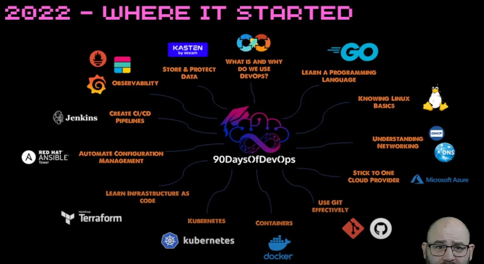
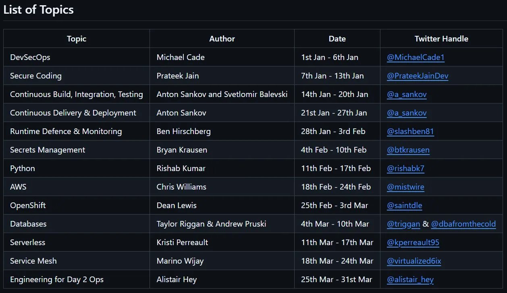

## DAY1 (Community Edition - Introduction)

### 1. 90 Days of DevOps 2024 Community Edition 소개

**1-1. 2022 강의에 대한 소개**

- **DevOps의 이해**: DevOps가 무엇이며 왜 사용해야 하는지에 대한 기초 학습
- **프로그래밍 언어 학습**: Go 언어를 중심으로 학습
- **Linux 기본**: Linux 데스크톱 사용
- **네트워킹**: OSI 계층 등 네트워킹의 기본 개념  학습
- Cloud Provider: Microsoft Azure  학습
- **Git 및 GitHub**: Git 및 Github Action 학습
- **container 및 Kubernetes**: **container와** Kubernetes 학습
- **Infrastructure as Code**: Terraform과 Pulumi를 활용한 IaC의 학습
- Application Layer: Ansible을 활용하여 학습
- **CI/CD 파이프라인**: Jenkins, Argo CD, GitHub Actions을 활용하여 학습
- **데이터 시각화**: Grafana, ELK 스택, Prometheus을 통해 학습
- 데이터 저장 및 보안: 데이터 보안, 사이버 보안 위협, 랜섬웨어에 대해 학습

**1-2 특징**

- 오픈소스 혹은 무료 에디션으로 구성되어있다

### 2. 2023년 Edition에서 추가된 내용

### 3. 2024 Edition

- 어떤식으로 구성됐고 만들어졌는지에 대한 설명