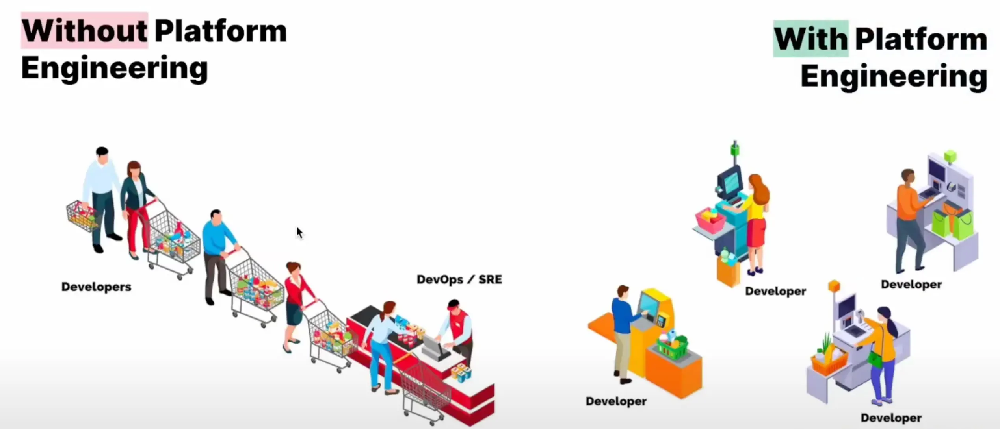
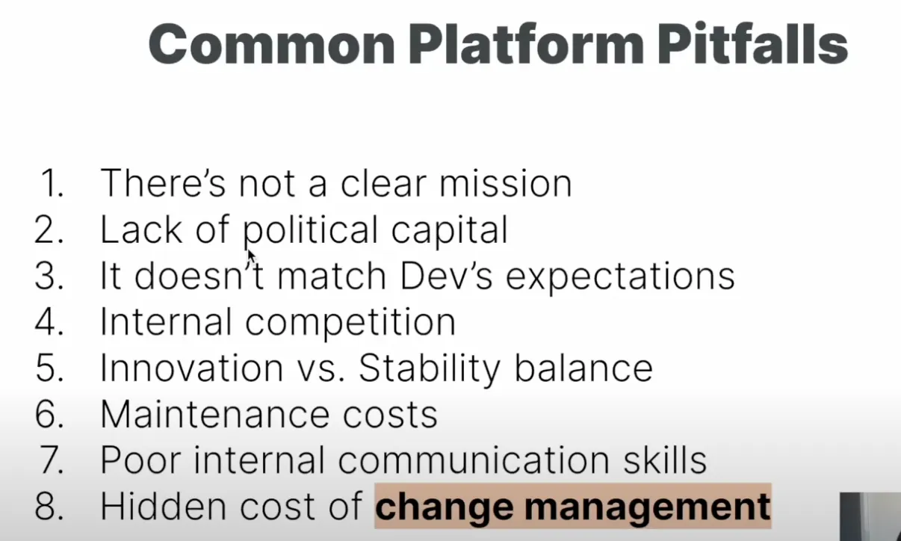
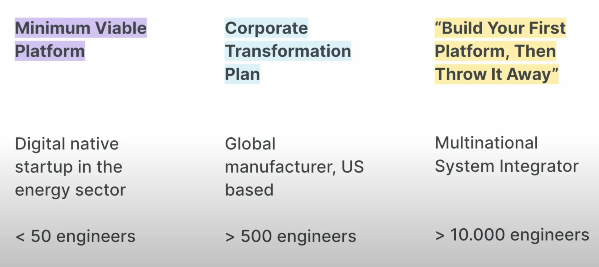

## Day 18 - Platform Engineering Is Not About Tech

### 1. 플랫폼 실패 현황

1-1. 현재 상황

- Gatner(미국의 글로벌 리서치 자문 회사) 및 시장 분석가들은 2025년 말까지 70%의 플랫폼이 결과를 달성하지 못한다.

→ 그래서 실패 방지를 위한 방법을 알아야한다.

### 2. 플랫폼 엔지니어에 대해

2-1. 플랫폼 엔지니어의 정의

- 플랫폼: 사람들이 가치를 공유하는 공용 공간

→ 공용 공간에서 개발자, 엔지니어, 기술자 등 사람들이 일상 업무에서 디지털 제품을 제공하는 데 가치를 공유하려고 노력하는 곳이다.

2-2. 플랫폼 엔지니어의 목표

- 목표: Self-Service Developer Experience
- 개발자와 다른 사람들이 가능한 적은 노력으로 가치있는 소프트웨어를 생산할 수 있도록 적잘한 기능을 제공
- 개발자 경험(DX)를 최우선으로 한다.

### 3. 기술 중심 사고의 한계

- 개발자에 대해 생각하지 않는다. 개발자의 니즈, 종속성, 업무 고려 x
- 새 기술, 구현, 표준화에 집중한다.
- → 하지말 플랫폼 실패의 핵심 원인은 아니다

3-1. 콘웨이의 법칙 (Conway’s Law)

- 시스템을 설계하는 모든 조직은 조직의 커뮤니케이션 구조를 기반으로 시스템을 설계한다
- 염두해 둔 설계가 있다면, 그 설계를 구현하기 위해서는 조직 내 소통 및 일하는 방식 또한 조정해야한다.
- 기술과 회사 조직? 팀? 그리고 일하는 방식 간의 강력한 연결성을 기억해야 한다.
- 기술과 함께 문화, 조직, 프로세스에도 집중하고 투자해야 한다
- 기술에만 투자하고 집중한다면, 조직, 문화, 프로세스는 자연스럽게 따라오지 않는다

→ 콘웨이 법칙의 근거는 제시하지 않는다.

### 4. 콘텐츠 실패의 8가지 이유

4-1. 목적 및 범위가 명확하지 않다.

- 운영에 문제가 있고 자동화하고 개선하기 위해 일을 한다.
- → 목표가 명확하지 않다.
- 제대로 설계된 계획이 없고 정확한 제품(목표)이 있어야한다.

4-2. 자본 부족

- MVP까지는 괜찮지만 이후 더 큰 규모로 성장하고자 할 때 성과가 없기 때문에 자본이 문제가 된다.
- (돈이 없으면) 서비스를 사용하도록 사람들을 끌어들이기 위해 추가적인 노력을 진행해야한다.

4-3. 개발자의 기대를 만족시키지 못함

- 개발자의 니즈를 파악하지 못한다. (커뮤니케이션 부족에서 발생)
- 큰 서비스를 약속했지만 그에 따른 초기 구성 단계에서 작은 기능 개발이 개발자를 지치게 한다(?)

4-4. 내부 경쟁

- 팀 내에서 발생하는 실력차이가 있을수도 있고
- 사용하고 싶은 기술이 중복될수도 있다. 혹은 각 팀만의 고유한 작업 방식을 고수할 수도 있다.
- 문제가 될 수 있을 팀들과 협력하여 진행한다

4-5. 혁신과 안정성과의 균형

- 개발자들은 항상 새로운 기술을 시도하고 싶어한다.
- 하지만 서비스에서는 안정성이 중요하기 때문에 밸런스를 잘 맞춰야한다.

4-6. 유지보수 비용

- 클라우드 서비스와 같은 플랫폼에서 발생하는 유지보수 비용을 간과해서는 안된다.
- 개발을 목표로 하면 플랫폼 관리를 소홀히 생각할 수 있다.

4-7. 부족한 커뮤니케이션 기술

- 플랫폼에 대한 합의(목표?)를 팀마다 공통되게 설정해야한다.
- 개발자, 운영팀, 엔지니어와 대화하여 그들에게 알맞는 방식과 목표가 제공되어야한다.

4-8. change management 비용

- 플랫폼 도입은 개발자, 운영팀, 엔지니어 모두에게 영향을 준다
- 개발 → 운영에서 발생하는 상황에서 변화를 받아들이지 못하는 팀이 있다.
- 플랫폼 운영팀이 주로 그런다.

### 5. 개발 외적인 요인

- 마케팅, UX, product management 팀에서 개발팀과 같은 에너지를 투자하지 않으면 결국 실패한다.
- 플랫폼 역시 제품이기 때문에 개발 외에도 전문적으로 관리되어야한다.

5-1. 개발자 해당

- 플랫폼은 기술로서 만들어지는 것이 끝이 아니다. 결국 플랫폼을 통해 원하는 성과를 이끌어내야한다.
- 개발자들이 플랫폼을 사랑하도록 플랫폼을 구축해라

### 6. 성공 사례 분석

6-1. digital native startup

- MVP 접근 방식 채택
- 최소한의 기능 구현만을 통해 신속하게 비즈니스 가치 제공. 전체 사용 사례 집중 x
- 40명의 엔지니어로 구성됐지만, 초기부터 협업이 필요한 두 팀의 특정 니즈에 집중
- 초기 성공 이후, 다른 부서로 플랫폼을 확장하는데 성공했다.

6-2. global manufacturing company

- 1000명 이상의 엔지니어와 많은 자본이 있다고 항상 성공하지는 않는다.
- 해당 회사는 예산의 대부분을 교육과 참여 유도에 투자한 것이 성공 요인이다.
- 프로젝트에 참여한 인원들은 모두 플랫폼을 완전히 이해했기 때문에 성공적으로 마무리할 수 있었다.

6-3. multinational large system integrator

- 기존 구축한 플랫폼을 버리고 처음부터 새로운 플랫폼을 구현했다.
- 이유:
- 빠르게 발전하는 플랫폼 엔지니어링에서 플랫폼을 운영할 전문 지식과 역량을 찾기 어렵다
- 시행착오를 겪으며 전문 지식을 쌓고 개발자 니즈를 파악할 수 있다.

- 플랫폼이 계속해서 성장한다면 유지보수가 힘들기 때문에, Thinnest Viable Platform 개념이 중요하다.
- Thinnest Viable Platform: 서비스와 시스템 개발을 가속화하는 데 필요한 가장 최소한의 도구

→ 플랫폼이 장기적으로 지속될 수 있도록 최소한의 도구에 집중적으로 투자한다.

→ 근본적인 부분을 중심으로 가져간다?

→ 불필요해졌거나 오래된 기능을 제거

→ 기술 시장은 빠르게 발전하므로, 플랫폼의 핵심 비즈니스 가치에 가장 가깝게 유지하기 위해 하위 구성 요소는 외부에서 구매하거나 아웃소싱할 수 있다.