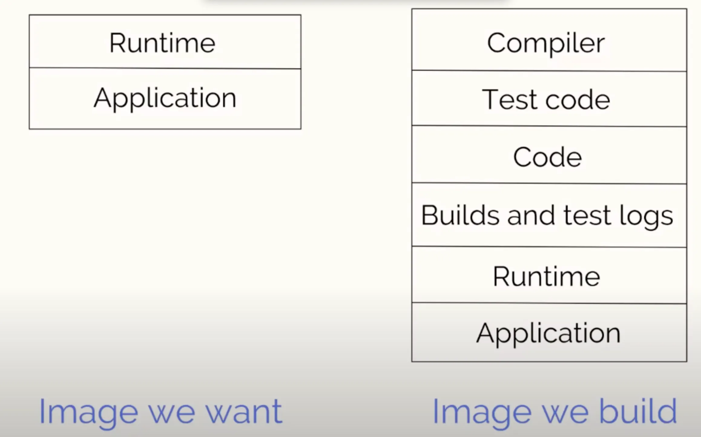
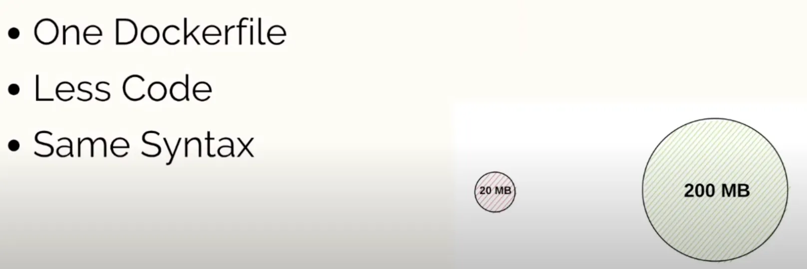
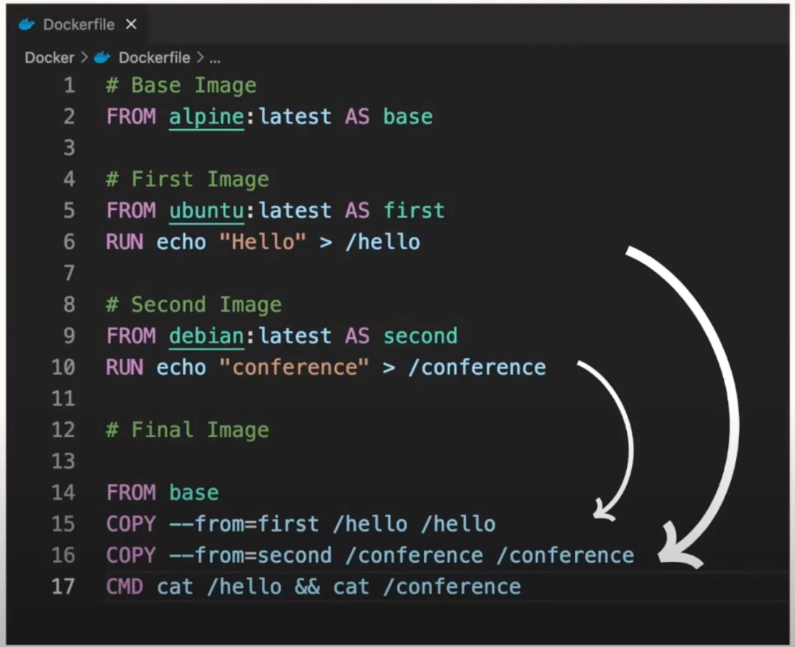
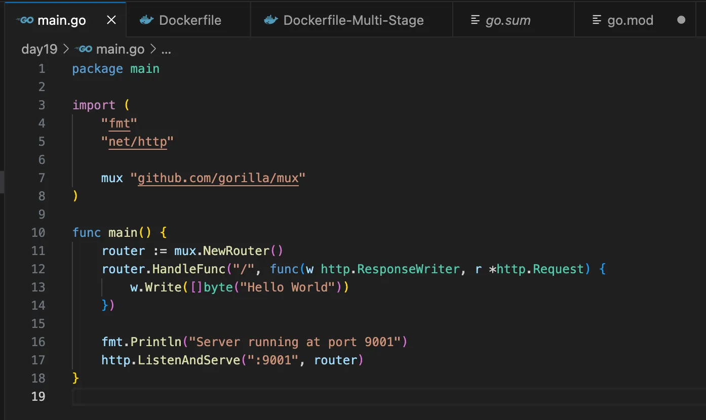
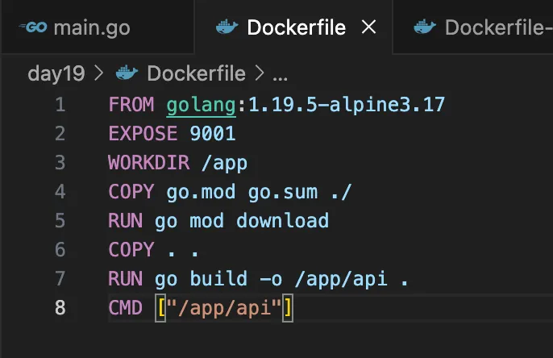
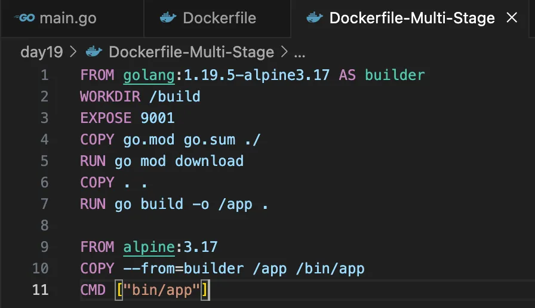
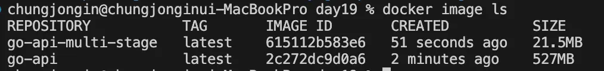

## Day 19 - Building Efficient and Secure Docker Images with Multi-Stage Builds

### 1. Multi stage build의 필요성 및 기본 개념

- 점점 많은 애플리케이션이 컨테이너화 되고 있어, 효율적이고 안전한 이미지 생성이 중요하다
- Docker의 멀티 스테이지 빌드는 이미지의 성능, 보안 및 효율성을 최적화

1-1. 기본개념

- 멀티 스테이지 빌드: 단일 Docker file 내에서 이미지 빌드 단계를 여러 단계로 나누는 것
- 여러 개의 Docker file을 생성하지 않고 단일 Docker file로 멀티 스테이지 빌드 기능 사용 가능

### 2. 최적화 되지 않은 이미지의 문제점

2-1. 소개

- 최적화된 이미지는 런타임과 애플리케이션을 포함한다.
- 최적화되지 않은 이미지는 컴파일러 테스트 코드 등이 포함되어 있다.
- 운영 환경에서 필요하지 않은 요소는 제외해야한다.

2-2. 이미지가 큰 컨테이너의 문제점

2-2-1. 보안

- 많은 패키지를 포함하기 때문에 어떤 패키지나 종속성이 보안에 취약할지 알 수 없다.
- 애플리케이션 자체에서 불필요한 부분을 제거해야한다.

2-2-2. 성능

- 다운로드 속도가 느려지고 더 많은 저장 공간이 필요하다
- 빌드 및 이미지를 레지스트리에 업로드하는 속도가 느려진다.

2-2-3. 효율성

- 빌드하는데 시간이 많이 소요되면 효율성이 많이 떨어진다.
- CI 실행 혹은 이미지 빌드에서 많은 시간이 소요되면 나머지 부분을 최적화 하더라도 해당 부분은 해결되지 않는다.
- 이미지 최적화 → 전체 프로세스 최적화

### 3. 멀티 스테이지 빌드의 이점 및 특징

- 단일 도커 파일 사용: Docker file 하나만 사용하여 진행할 수 있다.
- 코드 감소: 코드가 줄어들면 관리할 부분이 적어지고 버그 발생 가능성도 낮아진다.
- 동일한 Docker file 문법 사용: FROM, COPY, RUN 등 기존 도커 파일 구문을 그대로 사용한다
- 크기 감소: 200 → 20

3-1. 멀티 Docker File 예시

1. Alpine 이미지를 base로 사용한다
2. Ubuntu 이미지를 사용하고 first로 지정, hello파일을 생성한다.
3. Debian 이미지를 사용하고 second로 지정, conference 파일을 생성한다.
4. 앞서 생성했던 요소를 복사해서 실행한다.

- 전체 Ubuntu 또는 Debian 운영 체제를 복사하는 대신, 필요한 요소만 복사하여 최종 이미지를 구성한다
- 이미지에서 전체 운영 체제를 유지할 필요가 없다. 우리가 원하는 요소만 사용하며 최적화를 진행한다.

### 4. 실습

main.go

- 간단하게 hello world를 출력하는 웹페이지

Dockerfile

4-1. 일반적인 Dockerfile의 구조와 문제점

- 실행 파일 생성과 전체 애플리케이션 복사가 함께 진행된다. 최종 이미지에서 실행 파일뿐만 아니라 애플리케이션 파일까자 포함된다.
- 전체 애플리케이션 파일이 포함되어 이미지 크기가 커지는 비효율 발생

4-2. Multi Stage Dockerfile의 구조

Dockerfile-Multi-Stage

- FROM 구문이 존재하고 그것을 Builder로 표시한다.
- 빌드 관련 작업(디렉터리 설정, 포트, 의존성 다운)을 수행한다.
- → 실행 파일을 생성하기 위함

- 위에서 생성된 app 실행 파일을 bin 디렉토리로 복사한다.
- 최종 이미지에서는 이 실행 파일만을 실행한다
- 빌드 환경과 런타임 환경을 분리하여 최적화를 달성한다

4-3. 실행 결과

- 일반 이미지: 527MB
- 멀티 스테이지 빌드 이미지: 21.5MB

→ 차이가 크다

- 둘 다 정상적으로 작동