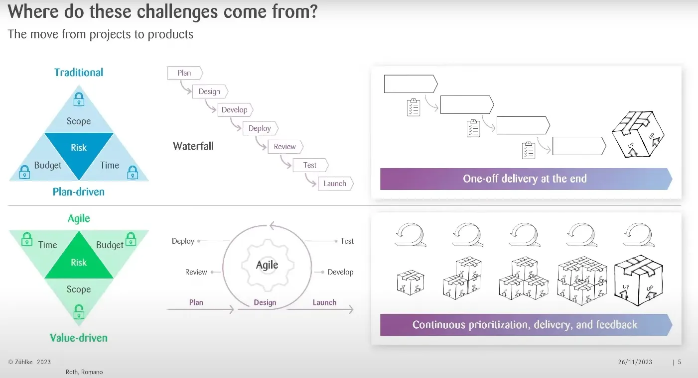
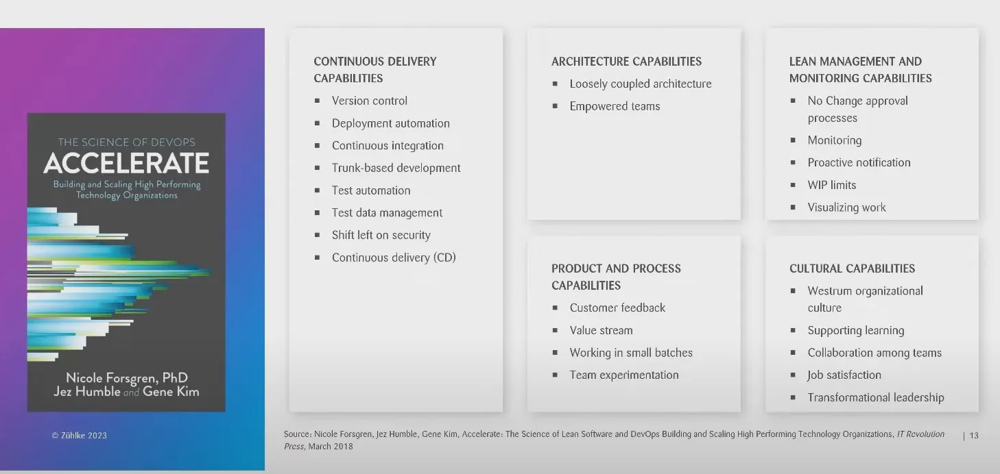
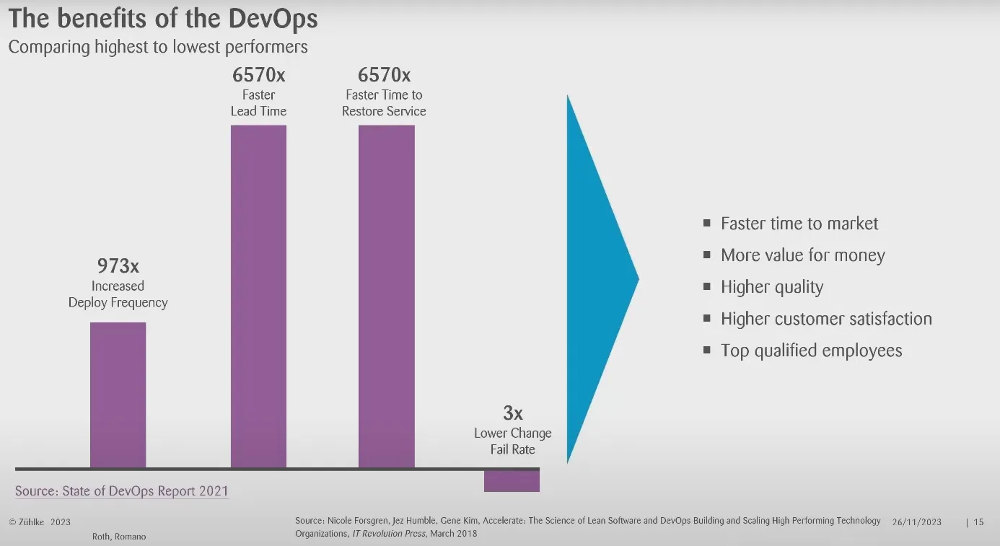
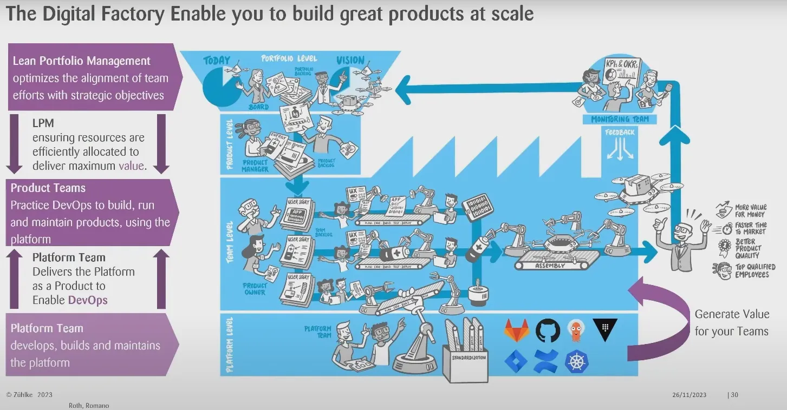
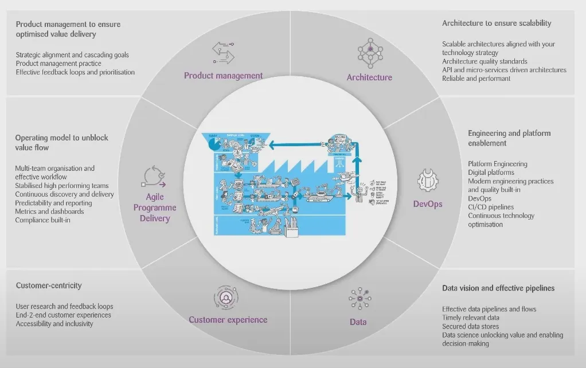

## DAY2 (The Digital Factory)

### 1. 과거 소프트웨어 개발의 문제점

- 기존 소프트웨어 개발은 사용자의 요구 사항을 정확하게 해결하지 못했다
- 소통의 부재와 각 팀마다의 업무가 분리되어있기에 목표가 다르고 거기에 따른 업무 비효율성 발생

### 2. 과거 소프트웨어 개발 방식

**2-1. waterfall project**

- 계획, 설계, 개발, 배포, 검토, 테스트, 출시가 순차적으로 진행
- 범위와 예산 시간 등이 정해지고 프로젝트를 진행한다.

**2-2. Agile 방식**

- 프로젝트를 작은 단위로 구분하여 개발
- 구현 범위를 유연성있게 대처
- 하지만 아직까지 사용자가 원하는 서비스(product)가 아니라 프로젝트를 생산한다

**2-3. product와 프로젝트의 차이**

- 프로젝트: 특정 시간과 예산 내에서 기능을 구현하는데 중점
- product: 고객의 문제를 해결하는 기능을 하나라도 구현하는 것이 중요하다.

### 3. DevOps

- product를 중심으로개발하는 방법론: 사용자에게 가치 전달이 중요하다
- Development + Operation
- 보안의 중요성으로 인해 DevSecOps 파생
- 비즈니스 팀으로 인해 BizDevOps 파생

3-1. DevOps의 성공 사례

- 넷플릭스, 구글, 페이스북, 테슬라(하드웨어)

### 4. DevOps의 24가지 핵심 역량

**4.1 Continuous Delivery 역량**

- Version Controll: fix forward나 rollback이 가능하다.
- Deployment automation
- Continuous integration
- Trunk based developmen**t**: ex) main branch
- Test automation
- 테스트 데이터 관리
- Shift Left on security: 보안을 초기에 진행
- Continuous Delivery

**4.2 Architecture 역량**

- Loosely coupled architecture: 낮은 결합도
- Empowered teams (?)

**4.3 Product and Process 역량**

- Customer feedback
- small batches
- Team experimentation
- Value Stream

**4.4 Lean Management and Monitoring 역량**

- No Change approval processes: 효율성을 위함
- Monitoring: 버그 예방
- WIP(Work In Process) limit
- Proactive notification
- visualizing work: 대시보드 or 칸반

**4.5 Cultural 역량**

- 조직문화에 대한 설명
- Westrum organizational culture
- Supporting learning
- Collaaboration among team
- Job satisfaction
- Transformation leadership

### 5. DevOps의 장점

- Deployment frequency 증가
- Lead time 향상
- 복구 시간 향상
- 리펙토링 실패율 감소

- Faster time to market
- More value for money
- Higher quality
- Higher customer satisfaction
- Top qualified employees

### 6. DevOps의 단점

- 팀의 책임 증가: 인프라, 런타임, CI/CD, 모니터링, 보안, 협업 툴, 애플리케이션 개발
- 기준이 생기질 않아서 새 프로젝트를 시작하면 처음부터 다시 시작한다.

### 7. Digital Factory

- 확장 가능한 DevOps

**7-1. 디지털 팩토리의 구성 요소**

- **Lean Portfolio Management**
- Platform Team
    - 플랫폼 자체는 팀이 사용하고 싶어 하는 제품
    - Product Team을 지원?,
- Product Team

**7-2. 디지털 팩토리의 추가적인 구성 요소**

- Architecture
- Data
- Customer Experience
- DevOps
- Agile Program Delivery
- Product Management