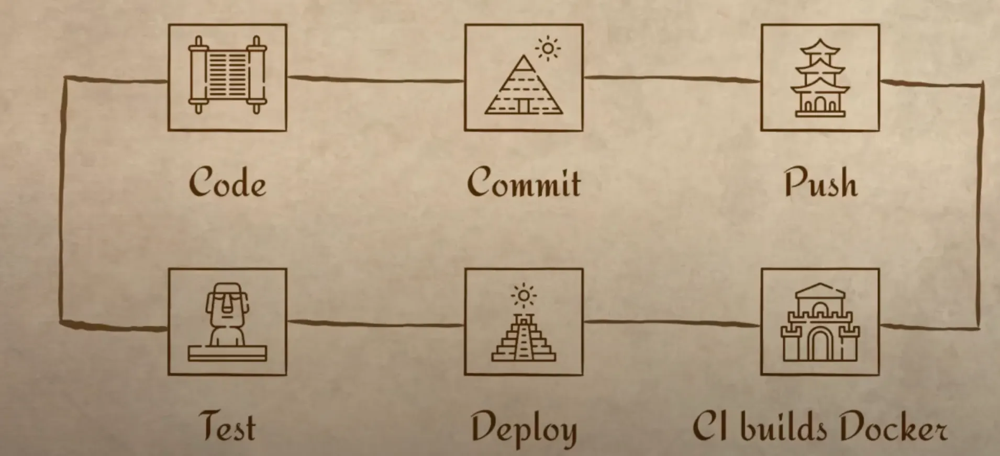
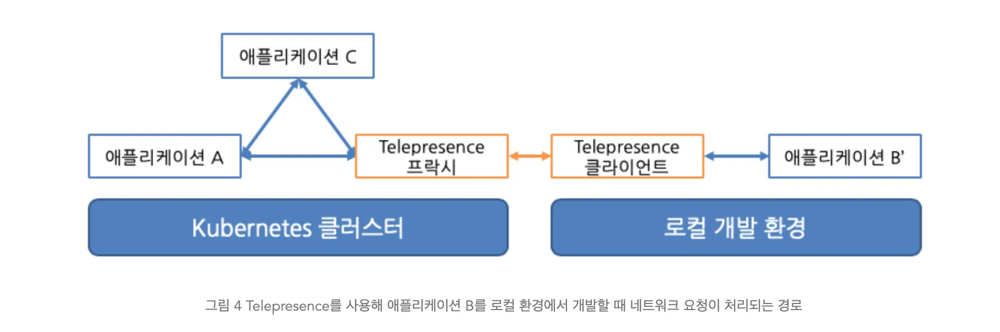
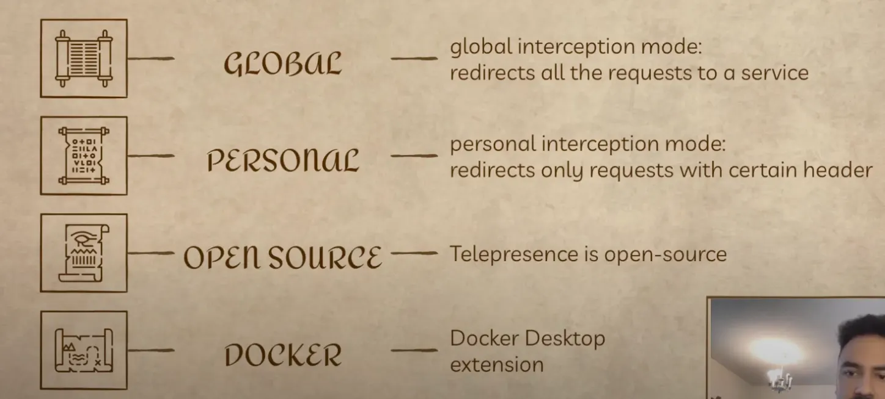

## Day 22 - Test in Production with Kubernetes and Telepresence

### 1. 시작 전 Telepresence 간단 소개

- Kubernetes를 사용할 때 코드를 작성하고 배포가 끝날 때까지 기다렸다가 테스트하는 Feedback Loop를 더 빠르게 만들어준다
- 커밋, docker build 대기 등의 배포 과정을 제거해서 더 빠르게 작업하고 피드백을 얻을 수 있다.

### 2. 실제 프로덕현 환경에서의 테스트 경험

- 2015년 근무 당시, 쿠버네티스 없이 12대의 서버를 사용했다.
- 각 서버에 SSH로 접속해서 코드를 배포하는 형식으로 진행했다.
- 동료의 실수로 12대의 서버가 모두 다운된 경험이 있다. (: 생략)

→ 해결책

- CI/CD 파이프라인과 피처 브랜치를 사용해서 코드 검증 후 메인 브랜치에 병합해야힌다.
- CI/CD 파이프라인이 모든 오류를 잡아주지는 못한다. 프로덕션 외 다른 환경에서 테스트를 먼저 진행해야한다.

### 3. 스테이징 환경에서의 테스트

3-1. 경험

- 프로덕션에서 테스트를 진행하지 않는 방법 → 스테이징 환경
- 프로덕션 환경의 복제본을 만들어 해당 환경에서 먼저 배포를 진행한다.
- 2018년 근무 당시 MongoDB를 사용했는데 쿼리를 문자열로 작성하여 데이터베이스에 전달했다.
- 실수로 쿼리 안에 “:” 값을 빠뜨리는 실수가 발생하고 스테이징 환경이 다운됐다.
- 스테이징 환경에서 발생한 문제였기에 운영 서비스에는 영향을 주지 않았다.

3-2. 스테이징 환경의 한계

- 스테이징 환경이 하나뿐일 경우, 여러 개발자가 동시에 배포하면 피드백 과정이 길어진다.
- QA 팀에서 자신의 PR을 진행할 때까지 기다려야한다. 한참 뒤에 진행하면 개발자가 무엇을 했는지 기억하지 못해 에러를 해결하는데 많은 시간이 소요될 수 있다.

### 4. 개인 스테이징 환경

4-1. 2022 베를린 원격 근무 경험

- 프로덕션 환경의 5개 복제본으로 개인 스테이징 환경을 사용했다.
- 구현이 끝나면 개인 스테이징 환경에 배포해서 수동으로 테스트하는 방식으로 진행

→ 문제점

- 버그가 발생하면 다시 구현하고, 푸시하고 CI 빌드를 기다려야 한다. (10분 정도 걸림)
- 개발 생산성이 낮아진다. → 오류가 발생할때마다 10분 대기 필요
- → Telepresence로 해결

### 5. Telepresence를 활용한 개발 생산성 향상

5-1. Telepresence의 기능

- Telepresence는 개발자가 코드를 푸시하거나 CI 빌드를 기다리지 않고 자동 테스트가 가능하다.
- -> 배포 후 피드백까지의 시간 단축

5-2. Telepresence의 작동 방식

- Telepresence는 스테이징 환경에 존재한다.
- 개발자는 로컬 환경에서 코드를 실행한다.
- Telepresence는 스테이징 환경의 서비스로 들어오는 모든 요청을 가로채 개발자의 로컬 환경으로 리디렉션한다.

- → 로컬에서 코드를 변경하면 kubernetes cluster에 이미 배포된 것처럼 즉시 테스트할 수 있다.
- 개발자는 로컬에 있으면서 원격 클러스터 서비스와 연결되는 것 (그래서 telepresence)

5-3. Interception 모드

- global Interception mode: kubernetes cluster 내 특정 서비스로 들어오는 모든 요청 리디렉션
- personal Interception mode: 특정 헤더를 설정하여 해당 요청만 리디렉션
- 여러 개발자가 하나의 스테이징 환경을 사용할 때, 각자 다른 요청을 자신의 로컬 환경으로 리디레션해서 같은 스테이징 환경에서 테스트 할 수 있다.

5-4. Telepresence의 특징

- 오픈소스이므로 지원 중단 걱정 없이 사용 가능 (?)
- Docker Desktop 기능으로 제공되어 GUI 환경에서 쉽게 사용 가능

- Telepresence 설정 및 사용 방법에 대한 내용은 블로그 게시판에 있다네요.
- [`arabi.medium.com`](http://arabi.medium.com) 접속안됨
- kubernetes cluster 설정부터, 테스트 방식까지 전반적인 사용 설명이 포함되어 있다.

### 6. 결론

- Telepresence는 피드백 과정을 단축시킨다.
- 스테이징 환경은 프로덕션 배포 전 코드를 테스트함으로써 안정성을 높일 수 있다.
- personal Interception mode를 사용해서 프로덕션 환경에서도 안전하게 테스트할 수 있다.
    - 스테이징 환경에서 확인하기 어려운 버그를 디버깅하거나 프로덕션 코드 자체를 확인해야 할 때 유용하다.
- 요즘은 과거와 다르게 여러 서비스가 복잡하게 연결되어 있기에, 로컬 개발 환경에서 전체 시스템을 실행하고 테스트하기가 어렵다.
- Telepresence를 사용하면 단일 서비스만 로컬 환경에서 실행하고, 이 서비스를 원격 클러스터에 연결해서 실제 요청을 받을 수 있다.

→ 실제 요청으로 인한 결과값이기에 개발 효율성을 높인다

마무리: Telepresence는 쿠버네티스 환경에서 피드백 과정을 단축하고 개발 생산성을 높이는 핵심적인 역할