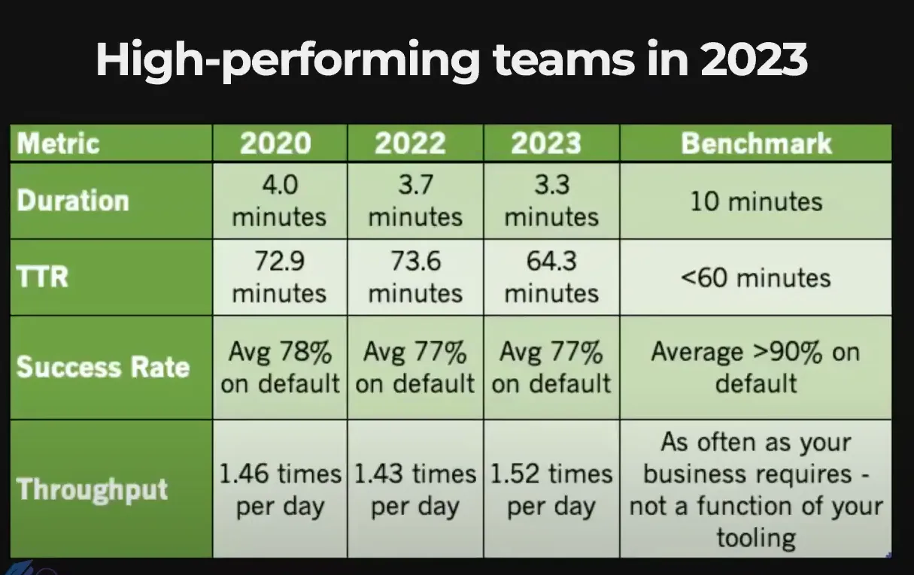

## DAY3 (High-performing engineering teams and the Holy Grail)

### 1. 고성능 엔지니어링에 대해

- 서비스 제공에 대한 기준이 높아지고 중요해지고 있다.
- 성장을 위주로 진행하다보니 안정성 문제가 발생했다.
- 떄문에 플랫폼 팀이 생겨나 DevOps를 전담한다.

### 2. 고성능 CI/CD 벤치카의 네 가지 핵심 지표

- **Duration**: 작업 단위가 파이프라인을 통과하는 데 걸리는 평균 시간. 빌드 소요 시간
- **Meantime to Resolve (MTTR)**: 실패한 빌드 신호에서 성공적인 파이프라인 실행까지 걸리는 평균 시간.
- **Success Rate**: 파이프라인 실행의 성공률.
- **Throughput:** 24시간 동안 코드베이스에 커밋되는 변경 사항의 수. 처리량

### 3. Duration

**3-1. Duration의 정의 및 중요성**

- 작업 단위가 파이프라인을 통과하는 데 필요한 평균 시간을 의미 ex) 개발 브랜치에서 단위 테스트 실행
- 속도를 올리느랴 안정성이 떨어지는 것을 신경써야한다.
- 이상적인 Duration은 10분 이하의 빌드 시간

3-2. Duration 보안 방안

- 단위 테스트, 통합 테스트, 테스트 주도 개발(TDD)이 성능 향상에 중요하다
- 속도와 테스트 범위의 균형을 맞추자

### 4. Meantime to Recovery

- 실패한 빌드에서 정상적인 파이프라인 복구까지 걸리는 평균 시간
- DevOps의 가장 많은 부분을 차지한다.
- 어떤 상황이든 60분 이내에 수정하는 것이 권장된다. 많은 지표와 연관되어 있다.

4-1. MTTR 보안 방안

- 브랜치 분리
- 기본 브랜치의 장애 발생을 방지한다.
- 복구 작업보다 다른 최적화 작업이 선행되어있어야한다. (성능 최적화 or 모듈화)

### 5. Success Rate

- 서비스의 안정성을 나타내는 지표
- success rate가 낮아도 빠르고 가치 있는 정보가 좋다. success rate에 너무 집착하지 않아도 된다.
- → success rate가 높은 가치 없는 서비스보다는 좋다는 소리.
- 기본 브랜치에서 90% 이상의 성공률을 유지해야한다.

### 6. Throughput

- 개발자가 24시간 동안 코드베이스에 커밋하는 수
- 팀의 flow를 측정하는데 유용하다
- 서비스의 품질과는 상관없다. 작업의 양이 서비스의 퀄리티를 정하지는 않으니까

### 7. 결론

- 핵심지표를 수집하고 최적화하는 것은 기업에게 이점을 가져다준다.

- 강의설명보다 GIF를 더 많이 본 것 같다.