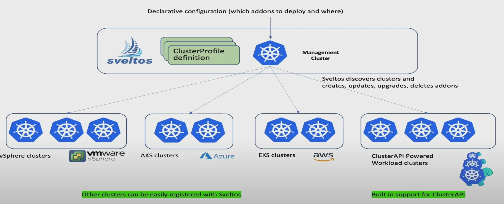
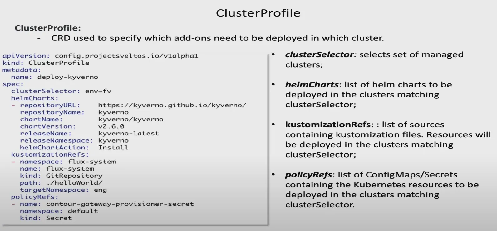
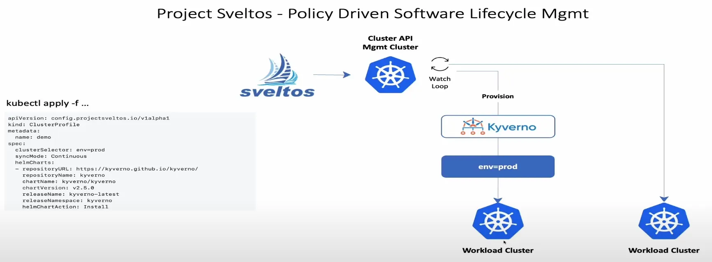
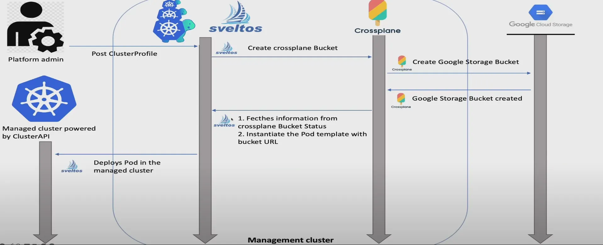
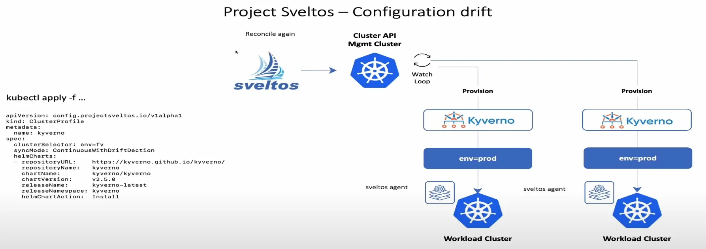
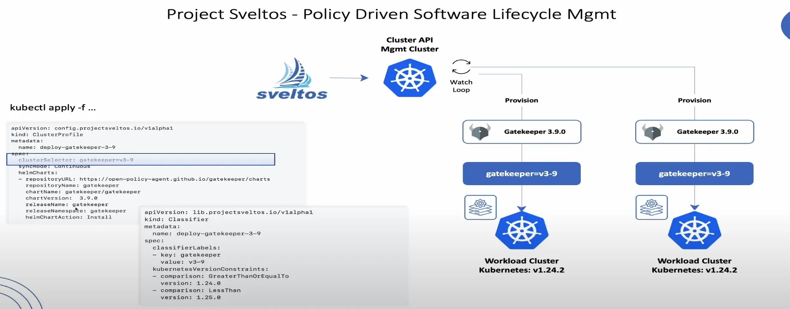
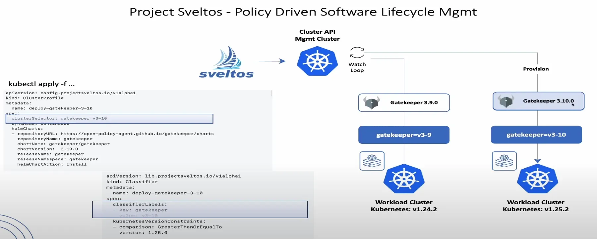

## DAY4 (Manage Kubernetes Add-Ons for Multiple Clusters Using Cluster Run-Time State)

### 1. Sveltos란

- Sveltos는 Cluster API 위에 구축되어 여러 클러스터에 걸쳐 애드온 및 애플리케이션을 프로그래밍 방식으로 관리하는 도구이다. Kubernetes 클러스터 관리를 위한 오픈소스 프로젝트

### 2. Sveltos의 작동 방식

- Management Cluster
- Cluster API에 대한 내장 지원 기능을 제공한다. Cluster API 기반 클러스터가 생성되면 Sveltos가 자동으로 이를 감지하고 관리한다.
- Management Cluster와 대상 클러스터 간의 네트워크 연결만 가능하다면 사용 가능하다

**2-1. ClusterProfile의 구조**

- 핵심 CRD
- **Helm charts 섹션**: 하나 이상의 배포할 Helm 차트를 지정한다.
- **customization refs 섹션**: customize 파일을 가져올 위치를 Sveltos에 지시

**→ ex)** Git 리포지토리에서 사용자 정의 파일을 가져오도록 지시

- **policy refs 섹션**: ConfigMap 또는 Secret에 YAML 및 JSON 형태의 config를 저장

2-2. Sveltos의 작동 방식

**배포 과정**

- 사용자가 profile을 게시하고, Sveltos는 prod environment 레이블과 일치하는 모든 클러스터를 찾도록 지시
- 일치하는 클러스터를 감지하면,  Sveltos는 모든 애드온을 해당 클러스터에 배포
- 두번째 클러스터의 다른 prod environment 레이블을 추가하면, Sveltos는 자동으로 이를 감지하고 해당 클러스터에 배포한다.

**철회 과정**

- 두번째 워크로드 클러스터에서 prod environment을 제거하면, 이클러스터에서 배포했던 애드온을 철회한다

### 3. Sveltos의 동적 관리 기능

- 애드온, 애플리케이션, Helm 차트, YAML 콘텐츠, ConfigMap 또는 Secret의 콘텐츠를 템플릿으로 표현할 수 있다.
- Management Cluster Resource Fetch: 특정 Cluster Resource를 Management Cluster에서 가져올 수 있다

### 4. 다른 프로젝트와의 연동

- **오픈소스 프로젝트 조정 가능**
- **Management Cluster에서 리소스 생성 기능**

ex)

- Sveltos는 Crossplane을 조정하여 배포 전에 정보를 가져오고,  템플릿을 인스턴스화하여 클러스터에 배포

### 5. Sveltos의 관리 기능

**5-1. Configuration Drift**

- Sveltos는 관리하는 클러스터를 항상 감지하고 있는다
- 누군가 배포를 삭제하면 즉시 다시 배포한다.
- 일관성 유지 보장

**5-2. 런타임 상태에 따른 클러스터 분류**

- 버전을 범위로 잡고 범위에 맞는 클러스터끼리 묶어서 배포를 진행한다.
- **Classifier CRD**를 사용한다.

- 이후 예제 진행
- 발음 너무 뭉개심