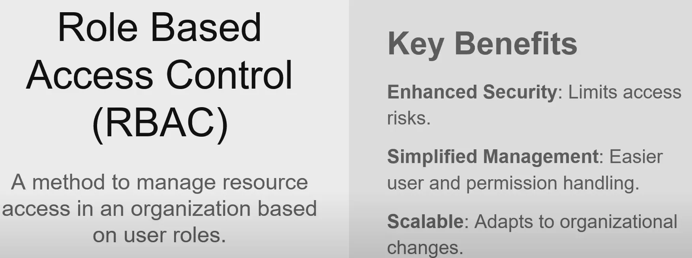
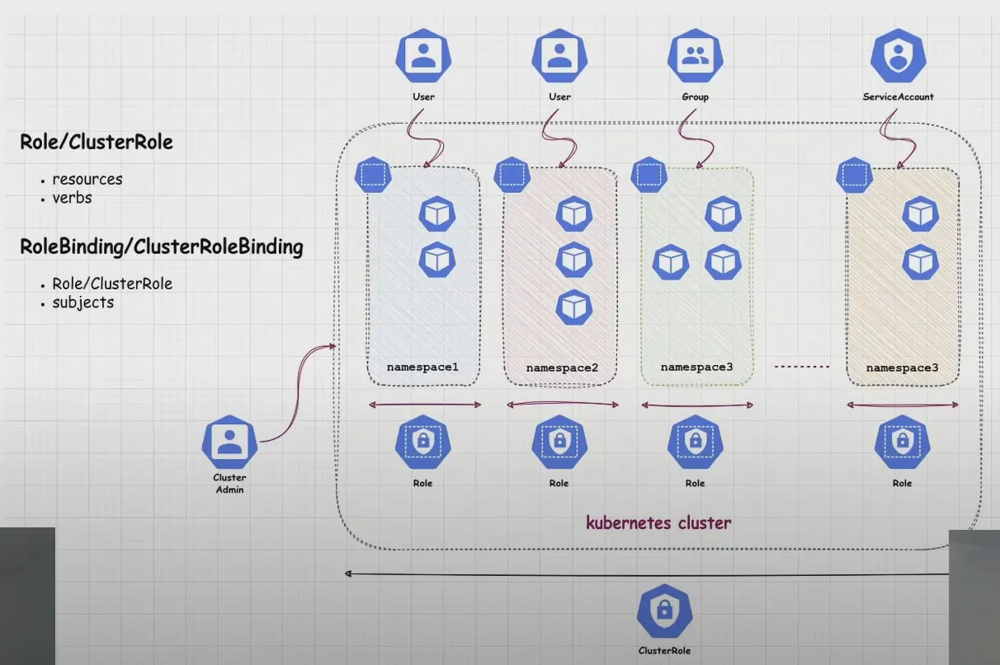
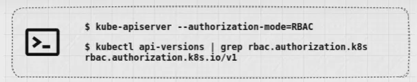
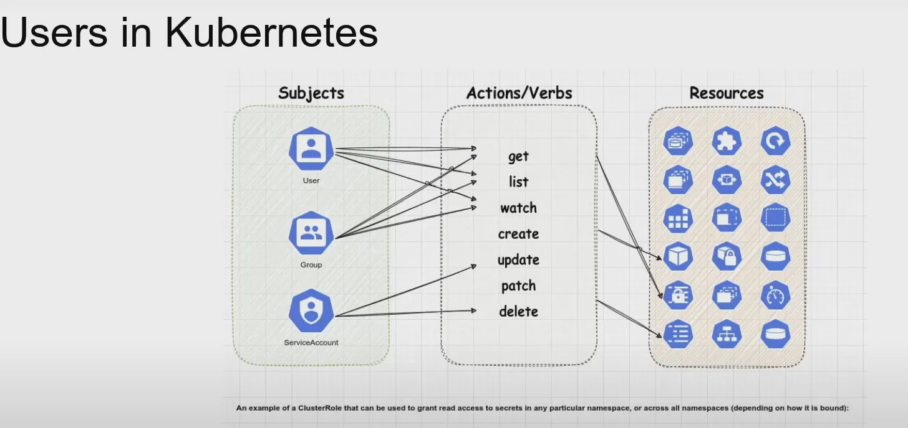
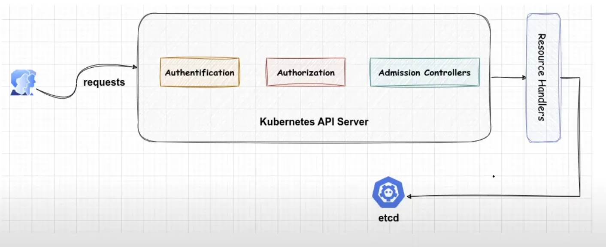
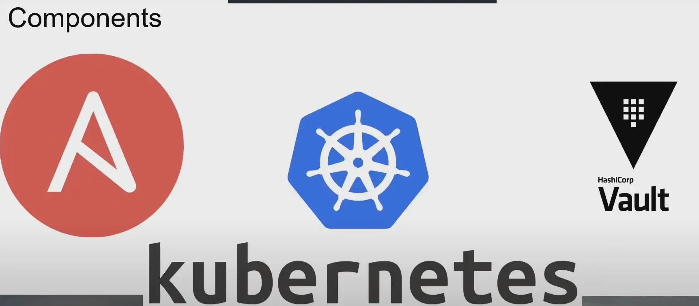

## DAY6 (Kubernetes RBAC with Ansible)

### 1. Kubernetes RBAC 소개

- 보안과 안정성을 보장하기 위해 적절한 Authentication Strategy를 선택해야한다.
- Authentication Strategy는 최소 권한 원칙을 준수해야한다.

### 2. RBAC의 개념



- 사용자 역할에 기반하여 컴퓨터 또는 네트워크 리소스에 대한 접근을 관리하는 보안 접근 방식
- 보안 강화: 권한 있는 사용자만 특정 데이터에 접근
- 관리 간소화: 개인에게 직접 권한을 할당하는 대신 역할에 할당한다.
- 최소 권한 원칙 준수: 사용자에게 역할 수행에 필요한 최소한의 접근 권한만 부여
- 운영 비용 절감: 권한 관리를 간소화하고 조직 전체에 걸쳐 접근 제어 정책의 일관된 적용을 보장

### 3. Kubernetes RBAC



- RBAC를 사용하여 권한 부여 결정을 관리하며, 관리자가 쿠버네티스 cluster 내 개별 사용자 또는 그룹의 역할에 따라 접근을 규제한다.
- **Role:** 특정 네임스페이스 내에서 적용되는 권한 집합
- **ClusterRole:** 클러스터 전체에 적용되는 권한 집합
- **RoleBinding**: Role에 정의된 권한을 사용자 그룹 또는 서비스 계정에 부여
- **ClusterRoleBinding**: ClusterRole에 정의된 권한을 클러스터 전체에 걸쳐 부여

- RBAC는 대부분의 주요 배포판(EKS, AKS 등)에서는 기본적으로 포함되어 있다.
- 클러스터에서 RBAC 기능 사용 가능 여부는

```
kubectl api-versions | grep rbac.authorization.k8s.io
```

- 명령을 실행하여 확인



### 4. RBAC API 객체 관리

- Role, ClusterRole, RoleBinding, ClusterRoleBinding
- 쿠번네티스 사용자 유형
    - Service Accounts: 쿠버네티스에 의해 관리
    - Normal Users: 쿠버네티스에서는 일반 사용자 계정을 나타내는 객체가 없다
    - cluster의 권한 인증서(CA)에 의해 유효한 인증서를 제시하는 사용자는 인증된 것으로 간주



### 5. 인증서 서명 요청 프로세스



5-1. kubectl apply 명령 실행 과정

- kubectl apply: kubernetes 리소스를 선언해서 관리
- 요청을 수신하면 API 서버는 올바릉 형식과 구문을 확인
- 객체를 cluster의 기본 데이터베이스인 etcd에 저장

5-2. TIL 인증서 및 CSR 프로세스

- Kubernetes 인증서 및  API가 자동화된 자격 증명을 지원
- 공개키와 신원 정보가 포함된 CSR 생성
    - CSR이 승인되면 Kubernetes CA가 인증서에 서명하고 사용자가 수령한다.


### 6. 데모: Kubernetes, Ansible, HashiCorp Vault



**6-1. 쿠버네티스**

- 컨테이너 관리 플랫폼
- 컨테이너의 가장 효율적인 배치 및 스케일링을 결정한다. → 애플리케이션의 구축 및 배포 복잡성 완화
- 프로세스를 간소화하고 리소스 활용도를 극대화하여 비용을 최소화
- 애플리케이션 배포 및 확장성, 모니터링, 복구 기능 등 다양한 기능을 제공한다

6**-2. Ansible**

- configuration management, 애플리케이션 배포, 인프라 서비스 오케스트레이션, provisioning과 같은 작업을 위한 자동화 도구
- 기존 SSH 및 WinRM 프로토콜에 의존해서 원격 머신을 실행한다.
    - 추가 소프트웨어 및 보안 프로토콜을 관리하는 오버헤드를 줄인다
- YAML로 작성된 플레이북을 활용하여 configuration을 작성한다.

**6-3. HashiCorp Vault**

- Secret 관리, 데이터 암호화, ID-based access접근에 특화된 보안 도구
- 데이터를 안전하게 저장 및 관리하기 위해 중앙 집중식 플랫폼을 제공한다.

### 7. 실습 진행

- Ansible과 Vault를 활용하여 작업
- 보안상에서 큰 강점을 가진다
- kubeconfig 파일을 생성하고 접근 테스트
- 조회는 가능하지만 편집은 안되는 상황 확인 → Ansible의 보안 명령으로 인한 보호

### 8. 마무리

8-1. RBAC 자동화 및 통합

- 일부 cluster는 특징 CSR을 자동으로 승인
- kubernetes cluster는 외부 권한 인증서와 통합하여 인증서 승인을 수행할 수 있다.

8-2. RBAC의 확장성 문제

- 권한 관리에는 탁월하지만, 대규모 환경에서는 관리가 어려워질 수 있다.