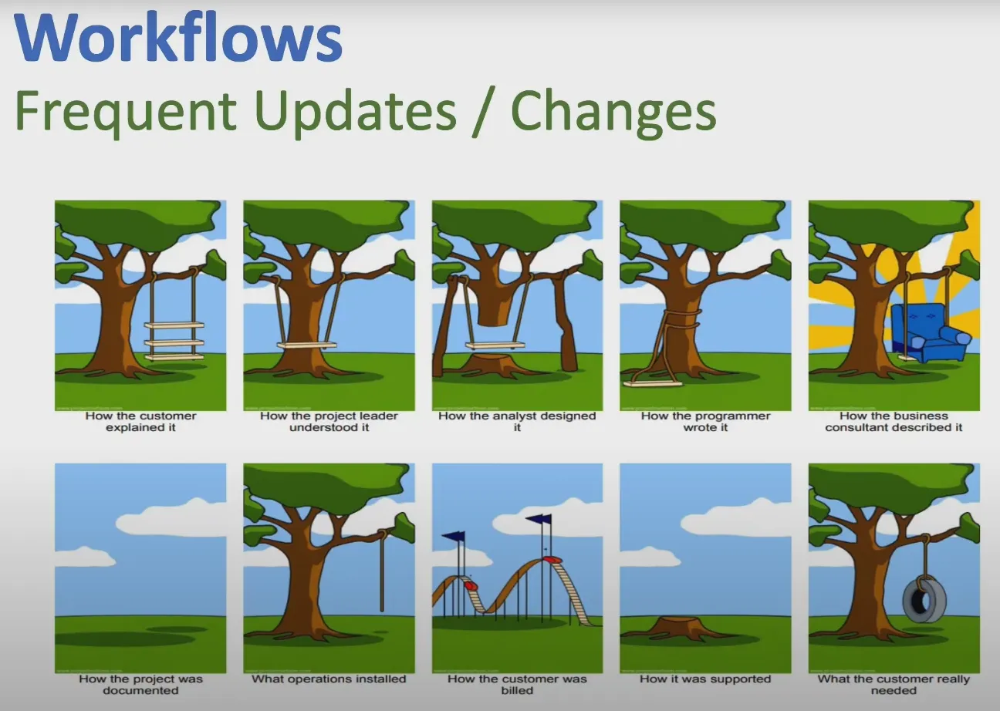

## DAY7 (Isn't Test Automation A Silver Bullet)

### 1. 테스트 자동화의 필요성

- 현대 소프트웨어 개발은 매일 새로운 기능이 업데이트되므로 지속적인 테스트가 필수적이다.
- 수동 테스트만으로는 모든 범위를 검증할 수 없기에 자동화된 테스트가 필요하다.

**1-1. 테스트 자동화의 장점**

- 시간 절약: 여러 가상 머신을 활용해서 테스트 범위를 분할하고 병렬실행한다.
- 테스트 범위 향상: 다양한 데이터 입력을 제공해서 데이터 기반 테스트 수행
- 인력 비용 감소

### **2. 테스트 자동화의 단점 및 해결 방안**

**2-1. 지속적인 업데이트**

- Agile 환경에서는 기능이 자주 업데이트 되거나 변경된다.
- 한번 구현된 테스트 시나리오라도 계속해서 리펙토링해야한다.

**해결방안**

- 지속적인 유지보수
- 고객 기대치와 실제 개발 결과 간의 차이 최소화

**2-2. 시스템 불안정성**

- 여러 인스턴스가 다른 결과를 반환하는 Canary deployments와 같은 테스트 활동은 예상 조건을 단정하기 어렵게 만들어 테스트 자동화의 안정성과 신뢰성 저해

→ Canary deployment: 일부 사용자에게 먼저 배포 진행 → 이후 확장

- 프런트엔드 문제: 웹 페이지의 동적인 스크립트나 레이아웃 변경으로 인해 element의 위치를 찾기 어렵거나, 페이지 로드, 새로고침 후 요소가 사라지는 경우가 발생

**해결 방안**

- 전통적인 locators 대신 테스트 ID와 같이 더 신뢰할 수 있는 고유 ID를 사용하여 element 위치 변경에 대응한다.

**2.3. 테스트 Testability 부족**

- **Testability** = 소프트웨어가 테스트되기 얼마나 용이한가 ****
- 전체 시스템 내에서 특정 하위 시스템을 테스트할 때, 다른 하위 시스템과의 상호작용 및 통합으로 인해 테스트가 어려울 수 있다.

ex) 테스트 대상 하위 시스템이 다른 시스템의 데이터 생성에 의존하지만, 해당 시스템에 접근하여 데이터를 생성할 권한이 없는 경우 테스트가 실행되지 않음

**해결방안**

- Mocks 객체 활용
- 테스트용 API 사용

**2.4. 하드웨어 의존성 및 AI component test 문제**

- 하드웨어 모듈과의 상호작용을 검증하기 위해서는 해당 메시지나 프로토콜을 시뮬레이션해야 한다. → 메시지를 가장해야하기에 복잡하다
- AI제품 (ML,AL)의 성능을 기능 테스트 자동화 관점에서 확인하기 어렵다

**해결방안**

- 하드웨어 시뮬레이션 환경 구축 (?)
- 수동 테스트

**2.5 Non functional aspects**

- 테스트는 사용성, 반응성, 유지보수성, 복구 가능성 등 다양한 비기능적 측면을 포함한다
- 테스트 자동화는 비기능적 측면을 포함하지 않는다

**해결 방안**

- 테스트 자동화 활동 외에 수동 테스트를 수행하여 비기능적 품질을 보완한다.
- Bug Bash 활동: 팀원 전체가 제품을 수동으로 사용하여 문제점을 발견
- Chaos Testing: 시스템의 일부를 일부러 다운시키는 등 테스트, 제품의 반응성 보

**2.6. 구현 및 유지보수**

- 프론트엔드 element를 가져오거나 백엔드 서비스 테스트를 위한 알고리즘 구현을 진행할 수 없다.
- 테스트 실행 시간이 너무 오래 걸리는 경우 존재
- 테스트 코드 중복 발생 가능

**해결 방안**

- 병렬 실행을 도입
- 특정 테스트 시나리오 내에서 시간이 오래 걸리는 단계를 분석하고, 중복되거나 불필요한 단계를 제거
- Helper classes를 도입해서 중복되는 메서드를 한 곳에 모아 관리

-> Helper classes: 공통적으로 여러 곳에서 쓰이는 메서드 모음

### 결론

**테스트 자동화의 단점**

- 서비스의 특성 또는 구현 방식에서 발생하는 문제: 잡은 업데이트와 시스템 불안정성
- 서비스의 ****Testability 혹은 component 문제
- 비기능적 측면
- 구현, 유지보수, 실행 관련 문제

**해결방안**

- 테스트 자동화에서 발생하는 문제를 정리하자
- 다양한 솔루션을 적용해야한다.
- 수동 테스트 활동을 무시하지말자